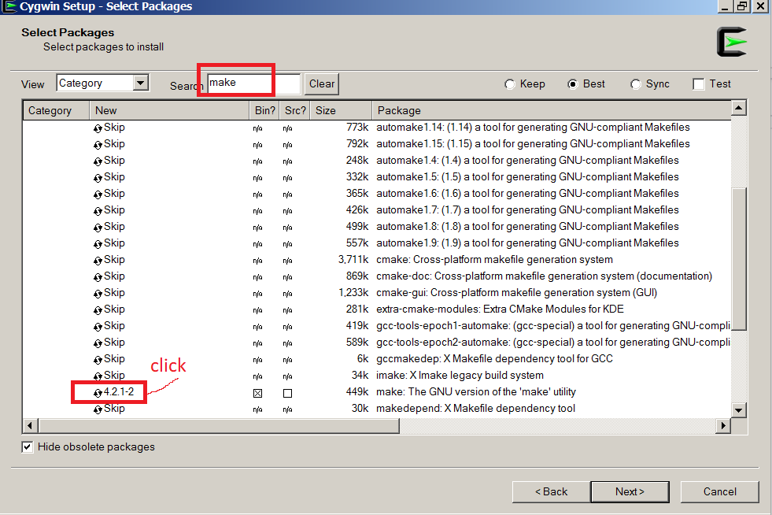

# libfm-windows
Building libfm on Windows with cygwin

Go to cygwin website and download it:


Run setup, click **Next** multiple times and select any mirror, select **make, wget and gcc** to install:




Click cygwin, download and build source code:

```
wget https://github.com/srendle/libfm/archive/master.zip
unzip master.zip
cd libfm-master
make
```

Now you can run executable:


If you want to launch exe from windows command line, you'll have to copy cygwin dll files near it or add cygwin to PATH.
